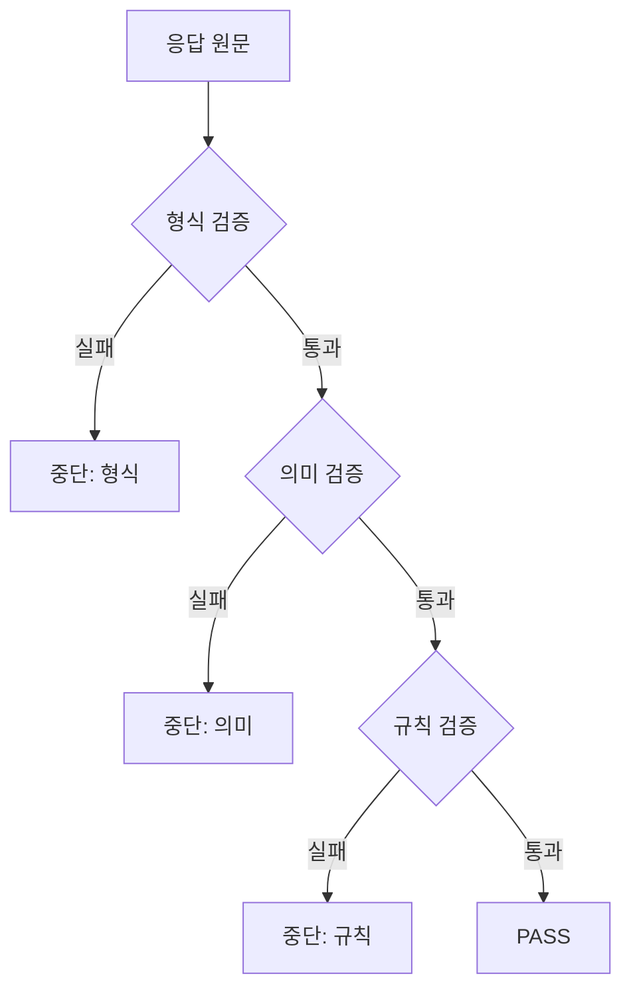
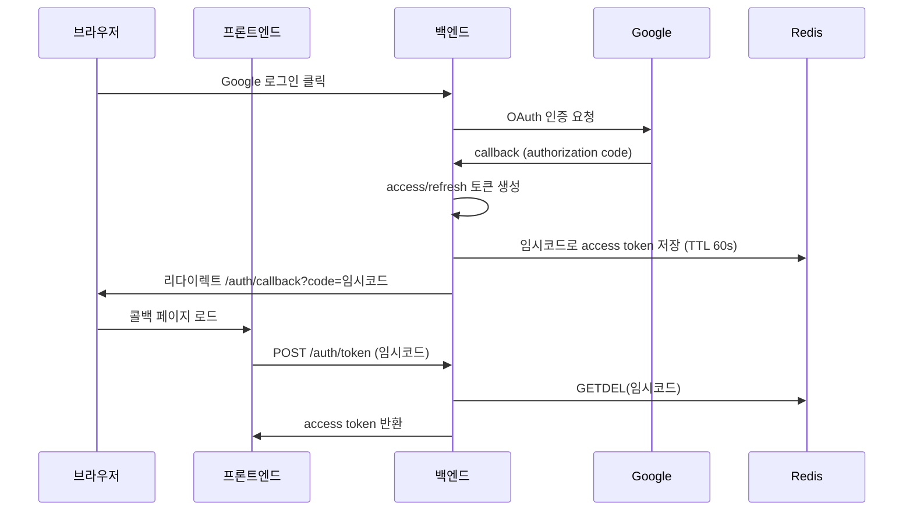

# PRS

<a href="https://github.com/mangmuse/prs-frontend">Frontend</a> | <a href="https://github.com/mangmuse/prs-backend">Backend</a>

 

**PRS**(Prompt Runbook Studio)는 프롬프트를 버전별로 관리하고, 
버전 간 실행 결과 차이를 한눈에 비교할 수 있는 웹 애플리케이션입니다.

 

이전 LLM 프로젝트에서 프롬프트 개선 작업을 진행하며, 수정한 프롬프트의 성능이 얼마나 개선되었는지 혹은 오히려 감소한 부분은 없는지를 정량적으로 측정하기 어려웠습니다. 이러한 경험을 바탕으로 프롬프트 버전 관리와 성능 비교를 체계적으로 수행할 수 있는 도구의 필요성을 느꼈고, 이것이 PRS 프로젝트의 출발점이 되었습니다.

## 목차

- [기술 스택](#-기술-스택)
  - [왜 React Hook Form인가](#왜-react-hook-form인가)
- [주요 기능](#-주요-기능)
  - [프롬프트 템플릿 버전 관리](#프롬프트-템플릿-버전-관리)
  - [LLM 호출 결과 시각화](#llm-호출-결과-시각화)
  - [버전 간 실행 결과 비교](#버전-간-실행-결과-비교)
  - [버전 간 실행 결과 상세 비교](#버전-간-실행-결과-상세-비교)
- [기술적 챌린지](#-기술적-챌린지)
  - [LLM 실행과 응답 평가 구조](#1-llm-실행과-응답-평가-구조)
    - [3단계 순차 평가](#3단계-순차-평가)
    - [Rate Limit 대응](#rate-limit-대응)
  - [게스트 우선 서비스의 인증 설계](#2-게스트-우선-서비스의-인증-설계)
    - [OAuth 플로우 설계](#oauth-플로우-설계)
    - [구현 흐름](#구현-흐름)

---

## 🛠 기술 스택

### Frontend

        

### Backend

    

### 왜 React Hook Form인가

#### 배경

PRS는 데이터셋, 평가 프로필, 프롬프트 템플릿 버전 등 폼이 많은 서비스입니다.

예를 들어 데이터셋 생성 폼의 경우, 여러 개의 테스트 행(row)을 입력받고 각 행 안에서 다시 여러 개의 key-value 입력 필드를 동적으로 추가/삭제할 수 있는 중첩 배열 구조를 가집니다. 또한 평가 프로필에서는 LLM 응답을 검증하기 위한 규칙(예: "특정 키워드 포함", "글자 수 500자 이하", "정규식 패턴 일치" 등)을 여러 개 등록할 수 있는데, 규칙의 종류에 따라 입력해야 하는 필드 자체가 달라지는 구조였습니다.

이처럼 중첩 배열과 가변 필드 구조가 핵심인 폼을 `useState`로 직접 관리하면, 항목 추가/삭제마다 여러 단계의 spread 연산이 반복되고 실수 가능성이 높아집니다.

또한 동적으로 항목을 추가/삭제하는 리스트에서 배열 인덱스를 key로 사용할 경우, 중간 항목 삭제 시 입력값이 다른 행으로 밀리는 문제가 발생할 수 있습니다. 이를 방지하려면 항목을 추가하는 시점에 고유 ID를 생성하고, 이를 각 항목의 상태에 함께 저장하여 관리해야 하기 때문에 복잡도가 증가합니다.

#### 선택 이유

React Hook Form은 중첩 배열 구조에서도 `append`, `remove`와 같은 선언적 메서드로 폼을 조작할 수 있고, 각 항목에 자동으로 고유 id를 부여하여 복잡한 수동 상태 업데이트를 제거할 수 있습니다.

대안으로는 Formik이 있었습니다. 다만 제어 컴포넌트 방식이라 입력마다 불필요한 리렌더링이 발생하고, 번들 크기가 React Hook Form의 약 2배(~17KB vs ~8.5KB)였기 때문에 React Hook Form을 선택했습니다.

---

## ✨ 주요 기능

### 프롬프트 템플릿 버전 관리

프롬프트 템플릿을 여러 버전으로 나누어 저장하고, 이전 버전과 비교할 수 있습니다. 과거 버전이 기록에 남기 때문에 프롬프트를 수정했다가 잘 작동하던 부분이 회귀하는 것을 방지합니다.

### LLM 호출 결과 시각화

프롬프트 템플릿과 데이터셋을 조합하여 LLM을 호출하면, 각 출력 결과가 기댓값과 일치하는지 확인할 수 있습니다. 일치하지 않는 경우 원인을 출력하며, 전체 데이터셋의 통과율, 검사 항목 부분 통과와 같은 지표를 한눈에 보여줍니다.

이를 통해 프롬프트의 어떤 부분을 수정해야 하는지 쉽게 파악할 수 있습니다.

### 버전 간 실행 결과 비교

동일한 데이터셋에 대해 서로 다른 프롬프트 버전의 실행 결과를 나란히 비교할 수 있습니다. 각 데이터 행을 개선, 회귀, 변경, 유지로 분류하고, 카테고리별 개수를 카드로 표시합니다.

이를 통해 프롬프트 수정 시 기존에 잘 작동하던 부분이 망가지는 회귀 현상을 즉시 감지하고, 수정 효과를 정량적으로 확인할 수 있습니다.

### 버전 간 실행 결과 상세 비교

비교 모드에서 개별 데이터 행을 선택하면, 두 버전의 실제 출력과 평가 결과(형식 검증 → 의미 유사도 → 규칙 기반 검사)를 나란히 비교할 수 있습니다.

"회귀"로 분류된 행을 클릭하면 이전 버전에서는 통과했지만 최신 버전에서 어느 단계에서 실패했는지 구체적으로 확인할 수 있습니다. 이를 통해 프롬프트 수정이 의도치 않게 기존 기능을 망가뜨린 부분을 즉시 파악하고, 다음 개선 방향을 결정할 수 있습니다.

---

## 🔥 기술적 챌린지

### 1. LLM 실행과 응답 평가 구조

> 3단계 순차 평가, provider별 동시 요청 수 제한, API Key 직접 입력 전환으로 구성된 실행 흐름

하나의 실행(Run)은 데이터셋의 모든 행에 대해 LLM을 호출하고, 각 응답을 자동으로 평가하여 통과율과 상세 결과를 제공하는 흐름입니다.

#### 3단계 순차 평가

LLM 응답은 형식 검증 → 의미 검증 → 규칙 검증 순서로 평가합니다. 앞 단계에서 실패할 경우 뒤 단계를 수행하지 않습니다. 어디에서 실패했는지 원인을 명확히 특정할 수 있고, 형식이 틀린 응답에 불필요한 외부 API 호출이 발생하지 않습니다.

형식 검증은 응답이 요청한 출력 형식(JSON, 라벨 등)에 맞는지 로컬에서 파싱합니다. 외부 호출 없이 즉시 판별할 수 있기 때문에 가장 먼저 실행합니다.

의미 검증은 응답과 기대값을 각각 벡터로 변환(embedding)한 뒤, 두 벡터의 방향 유사도(cosine similarity)로 의미적 일치 여부를 판단합니다. 외부 API 호출이 필요하기 때문에 형식 검증을 통과한 응답에만 수행합니다. 또한 output schema가 LABEL(TRUE/FALSE 같은 정확 일치)인 경우는 의미 비교 자체가 불필요하기 때문에 이 단계를 생략합니다.

규칙 검증은 특정 문자열 포함 여부, 숫자 범위, 정규식 매칭 등 사전 정의한 규칙으로 검증합니다. 파싱된 출력이 있어야 필드 단위로 검증할 수 있기 때문에 형식 검증 이후에 위치합니다.

#### Rate Limit 대응

처음에는 데이터셋 행을 하나씩 순차 호출했는데, 100개만 넘어도 실행 시간이 길어져서 병렬 처리로 전환했습니다. 그런데 외부 LLM API에는 provider마다 다른 rate limit이 있어서, 제어 없이 요청을 보내면 상당수가 거부되었습니다.

**1) provider별 동시 요청 수 제한**

94개 행을 동시에 요청하는 테스트에서 OpenAI는 전부 성공했지만, Anthropic은 34%가 실패했습니다. Anthropic의 분당 입력 토큰 제한이 엄격한 반면 OpenAI는 여유가 있었기 때문입니다. 모든 provider를 같은 기준으로 제한하면 한쪽은 불필요하게 느리고 다른 쪽은 여전히 실패했습니다.

모델 문자열에서 provider를 추출한 뒤, provider마다 동시 요청 수 제한을 다르게 설정했습니다. Anthropic은 5개, OpenAI는 50개, Gemini는 15개로 제한하고, Anthropic에는 반복되는 시스템 프롬프트를 캐싱해서 토큰 소비를 줄였습니다. 단일 사용자 기준에서는 이 조치로 rate limit 문제가 해결되었습니다.

**2) 다중 사용자 환경과 API Key 직접 입력 전환**

사용자가 여러 명 동시에 실행하면 — 100개씩 두 명만 돌려도 — 다시 rate limit에 걸렸습니다. 하나의 API Key를 공유하는 구조에서는 동시 요청 수 제한만으로 해결할 수 없는 문제였습니다.

Batch API를 검토했습니다. 114개 데이터셋으로 직접 테스트한 결과:

| Provider  | 소요 시간 |
| --------- | --------- |
| OpenAI    | 5.1분     |
| Gemini    | 10.0분    |
| Anthropic | 85.1분    |

OpenAI와 Gemini는 수용할 만했지만, Anthropic의 85분은 실용적이지 않았습니다. API 티어를 올리면 rate limit이 대폭 완화되지만, 실제 사용자와 수익이 있는 서비스라면 유효했을 방법이었으나 월 유지비가 100만원을 넘기 때문에 현실적이지 않다고 판단했습니다.

대신 사용자가 자신의 API Key를 직접 입력하는 방식을 택했습니다. 각자의 rate limit 안에서 요청이 처리되기 때문에, 사용자 수가 늘어나도 서로의 처리량에 영향을 주지 않습니다.

API Key는 서버에 저장하지 않습니다. 서버 DB에 암호화하여 저장하는 방식도 검토했지만, 암호화 키 관리 부담과 유출 시 책임 범위가 커지기 때문에 서버 비저장 방식을 택했습니다. React State와 localStorage로 브라우저에서 관리하고, 실행 요청 시에만 HTTPS Body에 포함하여 서버로 전달합니다. 서버는 LLM 호출 후 Key를 메모리에서 즉시 폐기합니다.

#### 결과

- 3단계 순차 평가로 실패 원인을 단계별로 특정할 수 있고, 형식 실패 시 불필요한 외부 API 호출을 생략합니다
- provider별 동시 요청 수 제한으로 단일 사용자 환경에서 rate limit 초과 없이 병렬 처리가 가능해졌습니다
- API Key 직접 입력 방식 전환으로 다중 사용자 환경에서도 서로의 처리량에 영향을 주지 않는 구조를 만들었습니다

#### 트레이드오프와 개선 방향

- 이 방식은 API Key를 직접 발급받아야 하기 때문에 진입 장벽이 있습니다. 로그인한 사용자에 한해 Key 없이도 간단한 체험이 가능한 데모 모드를 구현할 예정입니다.
- 의미 검증의 외부 API 호출에서 지연이 발생합니다. 동일한 입력/기대값 조합에 대한 결과를 캐싱하여 반복 호출을 줄일 예정입니다.

### 2. 게스트 우선 서비스의 인증 설계

> 게스트 세션, OAuth 임시코드 교환, 데이터 마이그레이션으로 구성된 인증 플로우

#### 배경

많은 사용자가 회원가입 없이 먼저 써보고 싶어하기 때문에 게스트 접근이 필요했습니다.
또한 URL은 브라우저 히스토리, 리퍼러, 서버 로그 등에 남기 때문에 OAuth 로그인 시 토큰이 URL에 노출되지 않도록 할 필요가 있었습니다.

#### OAuth 플로우 설계

Google OAuth 인증은 백엔드가 전담하는 서버 리다이렉트 방식을 택했습니다. client_secret이 프론트엔드 코드에 포함되지 않아 탈취 위험이 없고, Google과의 토큰 교환이 서버에서만 이루어지기 때문에 민감한 정보가 브라우저에 노출되지 않습니다.

이 구조에서 남은 문제는 서버가 발급한 access token을 프론트엔드에 어떻게 전달할지였습니다.

- **토큰을 redirect URL에 직접 포함**: 구현이 단순하지만, URL에 토큰이 그대로 남습니다.
- **임시코드로 교환**: URL에는 1회성 임시코드만 노출되고, 실제 토큰은 별도 API에서 교환합니다. 대신 교환용 엔드포인트와 임시 저장소가 필요합니다.

임시코드 교환 방식을 택했습니다. 구현 복잡도는 올라가지만, URL에 남는 코드가 60초 후 만료되고 1회 사용 후 삭제되기 때문에 노출되더라도 실질적 위협이 되지 않습니다.

#### 구현 흐름

**1) 로그인 없이 사용할 수 있는 게스트 세션**

첫 방문 시 `guest_id`를 HttpOnly Cookie로 발급하여 게스트를 식별하고, 로그인한 사용자는 토큰으로 식별합니다. 게스트와 회원 모두 같은 API를 사용하되, 회원 전용 기능만 토큰 인증으로 분리했습니다.

**2) OAuth 콜백: 토큰 대신 임시코드를 Redis에 저장**

OAuth 제공자에서 돌아오는 콜백에서 토큰을 발급하되, 프론트엔드에 직접 전달하지 않습니다.

1. 서버가 access/refresh 토큰을 생성
2. access token을 Redis에 임시코드로 저장
3. 프론트엔드는 `.../auth/callback?code=...` 형태로 리다이렉트
4. 프론트엔드가 `POST /auth/token`으로 code를 보내면 access token을 돌려받음

임시코드는 두 가지 장치로 보호합니다.

- TTL(만료 시간) 60초: 유출되더라도 금방 만료
- `GETDEL` (조회와 동시에 삭제): 교환되면 즉시 삭제돼서 재사용 불가

**3) Refresh Token은 HttpOnly Cookie, Access Token은 API 응답**

refresh token의 저장 위치는 세 가지를 검토했습니다.

- **localStorage**: 페이지 새로고침에도 유지되지만, XSS(Cross-Site Scripting) 공격 시 JavaScript로 직접 읽을 수 있습니다.
- **JavaScript 변수(메모리)**: XSS로 탈취할 수 없지만, 새로고침할 때마다 토큰이 사라져 재로그인이 필요합니다.
- **HttpOnly Cookie**: JavaScript에서 접근할 수 없어 XSS에 안전하고, 새로고침에도 유지됩니다. 대신 CSRF 위험이 생기지만 `SameSite` 속성으로 완화할 수 있습니다.

HttpOnly Cookie를 택했습니다. CSRF 위험이 생기는 단점이 있지만, XSS에 안전하면서도 새로고침 시 토큰이 유지되는 점이 더 중요하다고 판단했습니다. CSRF는 `SameSite` 속성과 `path="/auth"` 제한으로 완화했습니다. access token은 API 응답으로만 전달하여 메모리에서 관리하고, 만료되면 `POST /auth/refresh`로 갱신합니다.

**4) 로그인 후 게스트 데이터를 회원 계정으로 이전**

게스트 상태에서 데이터를 만들어 사용하다가 로그인한 사용자는 기존 데이터가 그대로 남아 있길 기대합니다.
로그인 직후 마이그레이션 여부를 묻는 모달을 띄우고, 사용자가 확인하면 이전을 수행합니다.

- 사용자 데이터 테이블 4개의 `guest_id`를 `user_id`로 치환
- 이전된 데이터의 종류와 건수를 모달에 표시
- 완료 후 `guest_id` 쿠키를 제거해서 소유권 상태를 단순하게 유지

#### 결과

- OAuth redirect URL에 토큰이 남지 않도록 설계하여 히스토리, 로그, 리퍼러를 통한 노출을 방지했습니다
- 임시코드는 TTL 60초 + 1회성(`GETDEL`)으로 재사용 공격을 방어합니다
- 게스트 세션과 마이그레이션 덕분에 "먼저 써보고 로그인" 흐름에서도 데이터가 유지됩니다

#### 트레이드오프와 개선 방향

- 임시코드 교환이 Redis에 의존하고 있습니다. 임시코드의 TTL이 60초로 짧아 데이터 유실 영향은 제한적이지만, Redis 장애 시 로그인 자체가 실패합니다. 이에 대비해 교환 실패 시 재시도 안내를 표시하는 UX와 Redis 상태 모니터링 도입을 검토하고 있습니다.
- Refresh cookie 기반이라 CSRF(Cross-Site Request Forgery) 위험이 있습니다. 현재는 `SameSite=Lax`와 `path="/auth"` 제한으로 대응하고 있으나, 서드파티 컨텍스트 대응이 필요해지면 Origin 헤더 검증이나 CSRF 토큰 도입을 계획하고 있습니다.
